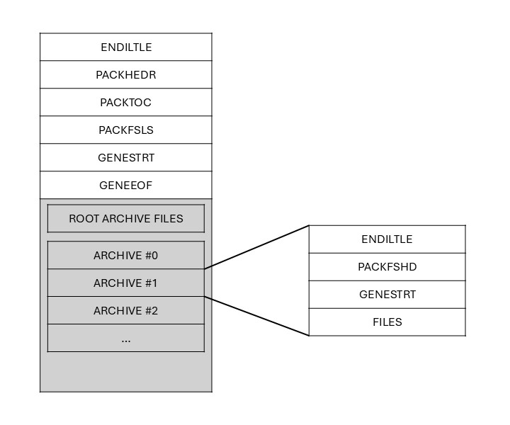
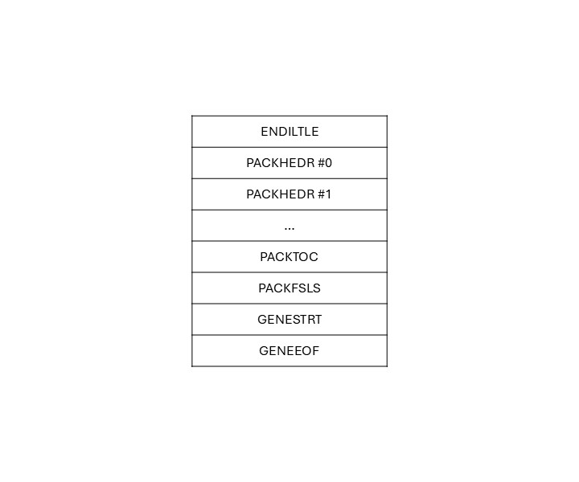

* Korean(this)
* [English](README_en.md)

# 개요
기본적으로 게임 <니세코이 요메이리!?> 한글 패치를 위해 만들어진 스크립트들입니다만, 동일한 포맷을 사용하는 다른 게임에 대해서도 사용할 수 있을지도 모릅니다. 다른 게임에 대해서는 테스트가 충분히 되지 않아서 오류가 날 수 있지만 적어도 분석에 도움은 될겁니다.

# 스크립트 도움말
```
python main.py [-h] < DUMP_APK    <options...>
                      | DUMP_IDX
                      | UNPACK_APK
                      | PACK_ALL_APK
                      | PACK_FS_APK  >
-------------------------------------------------------
-h              이 도움말을 출력합니다
SCRIPT_NAME     실행할 스크립트의 이름을 설정합니다 (필수)


:: 스크립트 사용방법 ::
python main.py DUMP_APK -i <input_apk_path> [-o <dump_output_path>] [-t <table|json>] [-q]

-i P    덤프할 apk 파일의 경로 P
-o P    덤프 결과를 저장할 경로 P
        이 옵션을 지정하지 않으면 파일로 저장되지 않고 터미널에 출력만 합니다.
-t T    덤프 결과의 유형을 선택합니다. 기본값은 table입니다.
        "table"은 파일들의 주요 정보만 출력합니다.
        "json"은 파일의 모든 부분을 분석하고 그 결과를 json으로 출력합니다.
-q      옵션 -o의 여부와 관계없이 덤프 결과를 터미널에 출력하지 않습니다.


python main.py DUMP_IDX -i <input_apk_path> [-o <dump_output_path>] [-t <table|json>] [-q]

-i P    덤프할 idx 파일의 경로 P
-o P    덤프 결과를 저장할 경로 P
        이 옵션을 지정하지 않으면 파일로 저장되지 않고 터미널에 출력만 합니다.
-t T    덤프 결과의 유형을 선택합니다. 기본값은 table입니다.
        "table"은 파일들의 주요 정보만 출력합니다.
        "json"은 파일의 모든 부분을 분석하고 그 결과를 json으로 출력합니다.
-q      옵션 -o의 여부와 관계없이 덤프 결과를 터미널에 출력하지 않습니다.


python main.py UNPACK_APK -i <input_apk_path> -o <dump_output_path> [-e <overwrite|skip>] [-d]

-i P    추출할 apk 파일의 경로 P
-o P    추출된 파일들을 저장할 폴더의 경로 P
-e T    추출하려는 파일이 이미 존재할 때 동작을 선택합니다
        "overwrite"는 기존 파일을 덮어씁니다
        "skip"는 기존 파일을 유지합니다
        기본값은 "overwrite"입니다
-d      디버그 정보를 출력합니다.


python main.py PACK_APK -i <input_apk_path> <directory_for_pack> [-x <input_idx_path>] [-o <output_dir_path>] [-d]

-i P Q  패킹에 사용할 apk 파일의 경로 P입니다.
        항상 원본 apk파일을 사용하는것을 추천합니다.
        이 파일은 변경되지 않습니다.
        패치할 파일이 포함된 폴더의 경로 Q입니다.
        폴더의 구조는 기존 apk 파일의 구조와 동일해야합니다.
        빠른 속도를 위해 실제로 수정되어서 패치할 파일만 남겨두는 것을 추천합니다.
-x P    idx 파일 패치를 원할경우 idx 파일의 경로 P입니다.
-o P    패킹된 apk 파일을 저장할 경로 P입니다.
        만약 -x 옵션으로 idx 파일을 선택했다면 idx 파일도 이곳에 저장됩니다.
-d      디버그 정보를 출력합니다.
```

# APK 파일 구조 분석
apk 파일은 게임에 필요한 각종 주요 데이터를 담고있는 아카이브 형식의 파일이다. 안드로이드 어플리케이션 설치 파일인 apk와는 전혀 관련없는 포맷이다.


기본적으로 위와 같은 구조를 가진다. 파일은 파일 가장 마지막에 나열되며, 추가적인 아카이브가 있는 경우 아카이브 또한 파일 마지막에 나열된다.
각 아카이브는 각자의 파일 데이터를 가지고 있다.

이 파일은 구조가 공식적으로 공개되지 안아 각 영역의 정확한 명칭을 알 수 없으므로 이 문서에서 임의로 붙였다.

## 파일 헤더
|이름|타입|크기(byte)|설명|
|:---:|:---:|:---:|:---|
|ENDIANESS|string|8|파일의 엔디안을 결정한다. <br> **ENDILTLE**: 리틀 엔디언 <br> **ENDIBIGE**: 빅 엔디언|
|PADDING|bytes|8|공간 채우기용 패딩|

## PACKHEDR
|이름|타입|크기(byte)|설명|
|:---:|:---:|:---:|:---|
|PACKHEDR|string|8|테이블 시그니처|
|HEADER SIZE|uint64|8|테이블 사이즈|
|unknown_1|?|8||
|FILE LIST OFFSET|int|4|파일 처음을 기준으로 ROOT ARCHIVE의 파일 영역 시작 지점 오프셋|
|unknown_2|?|4||
|unknown_3|?|16||
apk 파일의 테이블은 대부분 시그니처 8바이트 + 테이블 콘텐츠 사이즈 8바이트로 시작한다.
테이블 콘텐츠 사이즈는 이 16바이트를 제외한 나머지 부분의 크기를 의미한다.

즉 위 표를 봤을 때 HEADER_SIZE는 8+4+4+16=32바이트임을 알 수 있다.

## PACKTOC
|이름|타입|크기(byte)|설명|
|:---:|:---:|:---:|:---|
|PACKTOC|string|8|테이블 시그니처. 마지막 문자는 공백이다.|
|HEADER SIZE|uint64|8|테이블 사이즈|
|TOC SEG SIZE|int|4|TOC SEGMENT 1개의 크기|
|TOC SEG COUNT|int|4|TOC SEGMENT의 개수|
|unknown_1|?|4||
|ZERO|bytes|4|패딩|
|TOC_SEGMENT_LIST|TOC_SEG[]|TOC_SEG_SIZE * <br>TOC_SEG_COUNT|TOC SEGMENT의 나열|
|TABLE PADDING|||테이블의 크기가 16으로 나누어 떨어지도록 패딩|

테이블 PACKTOC, PACKFSLS, GENESTRT는 TABLE PADDING을 가집니다.
이 값은 테이블의 크기가 16의 배수가 아닐경우 남은 공간을 0으로 채워 16의 배수로 만들어줍니다.


### TOC SEGMENT
|이름|타입|크기(byte)|설명|
|:---:|:---:|:---:|:---|
|IDENTIFIER|int|4|파일의 유형을 구분하는 값|
|NAME IDX|int|4|GENESTRT 테이블에 존재하는 문자열 리스트에서의 파일 이름의 인덱스|
|ZERO|bytes|8|패딩?|
|FILE OFFSET|uint64|8|파일 처음을 기준으로 해당 파일 시작 지점 오프셋|
|SIZE|uint64|8|파일의 압축되지 않은 크기(byte)|
|ZSIZE|uint64|8|파일의 압축된 크기(byte)|

파일 압축은 기본적으로 zlib을 사용합니다.

#### IDENTIFIER
|값|hex|의미|
|:---:|:---:|:---|
|0|0x0000|압축되지 않은채로 저장된 데이터|
|1|0x0001|폴더로 추정. 실제로 추출하는 파일이 아님. 추출시 무시해도 문제없는것으로 추정|
|512|0x0200|압축된채로 저장된 데이터|

## PACKFSLS
|이름|타입|크기(byte)|설명|
|:---:|:---:|:---:|:---|
|PACKFSLS|string|8|테이블 시그니처|
|HEADER SIZE|uint64|8|테이블 사이즈|
|ARCHIVE COUNT|int|4|추가적인 아카이브의 개수|
|ARCHIVE SEG SIZE|int|4|ARCHIVE SEGMENT 1개의 크기|
|unknown_1||4||
|unknown_2||4||
|ARCHIVE SEG LIST|ARCHIVE_SEG[]|ARCHIVE_COUNT * <br> ARCHIVE_SEG_SIZE|ARCHIVE SEGMENT의 나열|
|TABLE PADDING|||테이블의 크기가 16으로 나누어 떨어지도록 패딩|
apk 파일은 1개 이상의 아카이브를 포함하거나 포함하지 않을 수 있습니다. 포함되는 경우 아카이브들은 파일 제일 끝부터 나열되며, 각 아카이브는 각자의 파일 정보를 가지고 있습니다.

아카이브가 존재하면 각 아카이브는 폴더가 되며, 각 아카이브의 파일들은 해당 폴더 안에 위치하게됩니다. 니세코이 요메이리의 경우 all.apk는 이러한 아카이브가 존재하지 않으며, fs.apk는 아카이브가 존재하여 폴더안에 파일들이 저장됩니다.

### ARCHIVE SEGMENT
|이름|타입|크기(byte)|설명|
|:---:|:---:|:---:|:---|
|NAME IDX|int|4|GENESTRT 테이블에 존재하는 문자열 리스트에서의 아카이브 이름의 인덱스|
|ZERO|int|4|패딩|
|ARCHIVE OFFSET|uint64|8|파일 처음을 기준으로 아카이브의 시작 지점 오프셋|
|SIZE|uint8|8|아카이브의 사이즈|
|unknown_1||16||

## GENESTRT
|이름|타입|크기(byte)|설명|
|:---:|:---:|:---:|:---|
|GENESTRT|string|8|테이블 시그니처|
|GENESTRT SIZE|uint64|8|테이블 사이즈|
|STR OFFSET COUNT|int|4|문자열 오프셋 값의 개수|
|unknown_1||4||
|HEADER SIZE +<br>STR OFFSET LIST SIZE|int|4|헤더 사이즈와 오프셋 리스트 사이즈의 합|
|GENESTRT SIZE|int|4|테이블 사이즈|
|STR OFFSET LIST|int[]||문자열 오프셋 리스트|
|PAD|bytes|4|패딩|
|STRING LIST|string[]||문자열 리스트|
|TABLE PADDING|bytes||테이블의 크기가 16으로 나누어 떨어지도록 패딩|

문자열을 저장하는 테이블입니다.

문자열 정보는 문자열의 오프셋값과 실제 문자열로 이루어집니다. 한 문자열은 STRING LIST의 시작 지점 오프셋에 해당 문자열의 오프셋 값을 더한 값을 오프셋으로 하는 지점에서 시작하여 null로 끝납니다.

## GENEEOF
|이름|타입|크기(byte)|설명|
|:---:|:---:|:---:|:---|
|GENEEOF|string|8|테이블 시그니처|
|ZERO|bytes|8|패딩|
|TABLE PADDING|bytes||파일 영역 시작 전까지 0으로 패딩|

테이블의 마지막을 나타내는 부분입니다. 이 이후로는 루트 아카이브의 파일 영역과 아카이브가 존재할 경우 아카이브의 리스트가 나옵니다.

TABLE PADDING의 크기는 PACKHEDR에서 나왔던 FILE LIST OFFSET에서 TABLE PADDING의 시작 오프셋을 뺀 수만큼으로 정해집니다.

## FILE LIST
이제부터는 파일들이 나열됩니다. 다만 단순히 나열되기만 하는것이 아닙니다. 한 개의 파일은 한 개의 블록에 담긴다고 생각할 수 있습니다. 이 블록의 크기들은 정해져있습니다. 블록은 파일을 담을 수 있는 크기 중 가장 작은 크기를 가지며, 남는 공간은 0으로 패딩합니다. 이러한 블록들이 나열됩니다.

블록의 크기는 다음과 같이 결정됩니다.
* 파일의 크기가 512의 배수인 경우
  * 파일의 크기가 곧 블록의 크기입니다.
  * 패딩없이 파일이 그대로 저장됩니다.
* 다른 경우
  * 512*n - 1의 값 중 파일을 담을 수 있는 최소한의 크기가 블록의 크기입니다.
  * 나머지 공간은 0으로 패딩됩니다.

예를 들어보겠습니다.
파일 크기가 23,552 바이트라고 가정하겠습니다. 이 크기는 512의 배수이므로 파일은 추가적인 작업 없이 그대로 나열되게 됩니다.

파일 크기가 2752 바이트라고 가정하겠습니다.
* (512*5)-1 = 2559입니다. 파일을 담기에는 작습니다.
* (512*6)-1 = 3071입니다. 파일을 담을 수 있습니다.
* (512*7)-1 = 3583입니다. 파일을 담을 수 있지만 더 작은 값인 3071이 존재하므로 더이상 계산할 필요가 없습니다.

그러면 패딩의 크기는 3071 - 2752 = 319바이트가 됩니다.
이 파일은 추가된 후 319바이트 만큼 0으로 패딩을한다음 다음파일이 나열되게 됩니다.

## ARCHIVE LIST
만약 PACKFSLS 테이블에서 ARCHIVE COUNT가 0이 아니었다면 아카이브가 나열됩니다. 아카이브의 구조를 살펴보겠습니다.

### ENDIANESS
|이름|타입|크기(byte)|설명|
|:---:|:---:|:---:|:---|
|ENDIANESS|string|8|아카이브의 엔디안을 결정한다. <br> **ENDILTLE**: 리틀 엔디언 <br> **ENDIBIGE**: 빅 엔디언|
|PADDING|bytes|8|공간 채우기용 패딩|

### PACKFSHD
|이름|타입|크기(byte)|설명|
|:---:|:---:|:---:|:---|
|PACKFSHD|string|8|테이블 시그니처|
|HEADER SIZE|uint64|8|테이블 사이즈|
|unknown_1||4||
|FILE SEG SIZE?|int|4|파일 세그먼트의 사이즈로 추정|
|FILE SEG COUNT|int|4|파일 세그먼트 개수|
|unknown_2|int|4|FIEL_SEG_SIZE와 같은 값. 왜 중복인지는 알수없음|
|unknown_3||4||
|FILE SEG LIST|FILE_SEG[]|FILE_SEG_SIZE*<br>FILE_SEG_COUNT|파일 세그먼트의 나열|

#### FILE_SEGMENT
|이름|타입|크기(byte)|설명|
|:---:|:---:|:---:|:---|
|NAME_IDX|int|4|GENESTRT 테이블에 존재하는 문자열 리스트에서의 파일 이름의 인덱스|
|ZIP|int|4|파일 압축 여부.<br>**0**: 압축되지 않음<br>**2**: zlib 압축|
|OFFSET|uint64|8|ARCHIVE OFSET을 기준으로 파일 시작 지점 오프셋|
|SIZE|uint64|8|압축되지 않은 파일의 크기|
|ZSIZE|uint64|8|압축된 파일의 크기. ZIP이 0이면 ZSIZE도 0임|

### GENESTRT
|이름|타입|크기(byte)|설명|
|:---:|:---:|:---:|:---|
|GENESTRT|string|8|테이블 시그니처|
|GENESTRT SIZE|uint64|8|테이블 사이즈|
|STR OFFSET COUNT|int|4|문자열 오프셋 값의 개수|
|unknown_1||4||
|HEADER SIZE +<br>STR OFFSET LIST SIZE|int|4|헤더 사이즈와 오프셋 리스트 사이즈의 합|
|GENESTRT SIZE|int|4|테이블 사이즈|
|STR OFFSET LIST|int[]||문자열 오프셋 리스트|
|PAD|bytes|4|패딩|
|STRING LIST|string[]||문자열 리스트|
|TABLE PADDING|bytes||테이블의 크기가 16으로 나누어 떨어지도록 패딩|

### FILE LIST
아카이브의 파일들은 루트 아카이브와 패딩 방식이 다릅니다.
루트 아카이브의 파일 패딩 수는 (512*n)-1로 블록 크기를 계산하여 사용하였지만, 아카이브 파일은 테이블 패딩을 하듯이 파일의 크기가 16으로 나누어 떨어지도록 패딩합니다.

즉, 아카이브 파일의 패딩의 크기는 최소 0에서 최대 15입니다.

# IDX 파일 분석


idx 파일은 apk 파일과 매우 유사합니다. 확장자에서 알 수 있듯이 이 파일은 apk 파일의 파일들에 대한 인덱스를 저장합니다.
* idx 파일에는 인덱스 한 파일의 PACKHEDR이 복사되어 나열되있습니다.
* idx 파일에는 실제 파일 데이터가 없습니다.
* idx 파일에는 아카이브가 없습니다. (아마도)

두 파일에 포함된 파일의 오프셋, 크기, 이름 등의 데이터만 저장되어있으며, 나머지는 apk 파일과 같습니다.

다만 아직 획실하지 않은 점이 있는데, 니세코이 요메이리!?의 경우에는 fs.apk에 폴더 형식으로 저장되어있는 파일들이 pack.idx에 존재하지 않습니다. 물론 파일 자체는 all.apk의 것과 동일하므로 상관은 없을지도 모릅니다.

아직 fs.apk의 존재 이유를 확실하게 알지 못하므로 pack.idx 파일이 두 파일로부터 인덱스를 어떻게 생성하는지 정확하게 알 수는 없습니다.

현재 pack.idx 파일은 단순히 all.apk의 인덱스를 모아둔 것으로 보입니다.